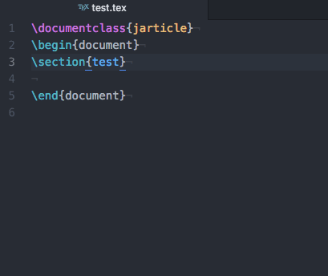

# latex-itemizer

For latex-itemizer

## Usage

| Command Name                   | Key Binding               |
|--------------------------------|---------------------------|
| latex-itemizer:newline-item    | ```Alt         + Enter``` |
| latex-itemizer:newline-itemize | ```Alt + Shift + Enter``` |


## Demo



## Installation

Install from the Atom Package manager or the command line:

```$ apm install latex-itemizer```
